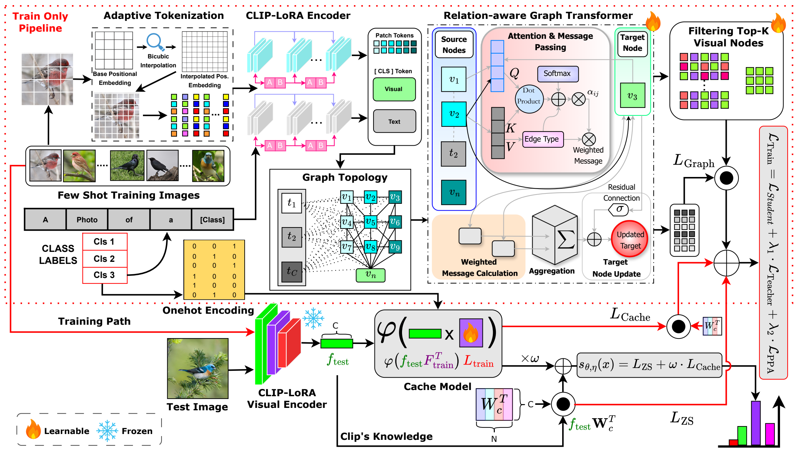

# SD-LoRA: Training-Time Structural Distillation into LoRA for Few-Shot Vision-Language Adaptation

[](https://neurips.cc/)

[](https://pytorch.org/)
[](LICENSE)

**Official PyTorch implementation of the NeurIPS 2026 paper “SD-LoRA: Training-Time Structural Distillation into LoRA for Few-Shot Vision-Language Adaptation.”**

**Authors:** Mohammed Rahman Sherif Khan Mohammad, Ardhendu Behera, Sandip Pradhan, Swagat Kumar, Yonghuai Liu

**Institution:** Edge Hill University

**Paper:** arXiv coming soon

---

## Abstract

Few-shot adaptation of vision-language models needs to learn fine-grained visual distinctions from limited supervision while keeping inference efficient. Lightweight CLIP adapters usually work with global image embeddings, leaving token-level structure underused. SD-LoRA uses a relation-aware graph Transformer (RGT) over visual tokens and class-text features **during training**, then distills its structural signal into a LoRA-adapted CLIP backbone. Prototype Predictive Alignment connects graph-conditioned representations to support-derived class prototypes. At inference, the graph branch is removed; prediction uses CLIP-LoRA and a cache classifier.

## Key Contributions

- **Training-time structural distillation:** The RGT reasons over visual-token and class-text nodes to supervise the shared CLIP-LoRA encoder without requiring the graph branch at test time.
- **Prototype Predictive Alignment:** Graph-conditioned features are aligned with support-derived class prototypes.
- **Compact deployment:** Inference uses the LoRA-adapted CLIP encoder and cache classifier.
- **Few-shot evaluation:** The paper reports results on 11 benchmarks across 1, 2, 4, 8, and 16 shots per class.

## Method Overview



1. **Build a support cache** from the labeled examples and CLIP features.
2. **Train with structural supervision** from the RGT over image tokens and class text, alongside the LoRA and cache objectives.
3. **Deploy the adapted encoder** with the cache classifier; the graph teacher is not used at inference.

The figure is rendered from the authors’ framework diagram.

## Installation

Use Python 3.11 and a CUDA-capable GPU. Install matching PyTorch and torchvision CUDA builds, then the remaining dependencies:

```bash
git clone https://github.com/MR-Sherif/SD-LoRA.git
cd SD-LoRA
python -m venv .venv
source .venv/bin/activate
# Install torch and torchvision for your CUDA version first.
pip install -r requirements.txt
```

If needed, follow the [PyTorch Geometric installation guide](https://pytorch-geometric.readthedocs.io/en/latest/install/installation.html) for platform-specific extension wheels. On Windows, use `.venv\Scripts\activate`.

## Datasets

SD-LoRA follows the 11-dataset few-shot protocol: ImageNet, Caltech-101, Oxford Pets, Stanford Cars, Oxford Flowers, Food-101, FGVC Aircraft, SUN397, DTD, EuroSAT, and UCF101. Prepare their files and split JSONs as described in [DATASETS.md](DATASETS.md). The data root is supplied at launch; dataset files and pretrained CLIP weights are not included. The bundled CLIP loader downloads weights on first use.

## Reproducing Results

The release has one training entry point and one copy of each shared model component. Individual dataset loaders and YAML files retain their dataset-specific paths, templates, and training settings.

| Path | Purpose |
| --- | --- |
| `main.py` | Shared training and evaluation |
| `rgtmodel.py`, `graph_builder.py` | RGT model and graph construction |
| `datasets/` | Dataset loaders and the common graph data loader |
| `configs/` | Dataset configuration files |
| `clip/` | Bundled CLIP implementation |
| `ood_evaluate.py` | ImageNet out-of-distribution evaluation |

Run from the repository root with the parent directory of your datasets:

```bash
python main.py --config configs/dtd.yaml --shots 4 --root_path /path/to/data
python main.py --config configs/fgvc.yaml --shots 1 --root_path /path/to/data
python main.py --config configs/imagenet.yaml --shots 16 --root_path /path/to/data
```

Supported shot counts are 1, 2, 4, 8, and 16. Use `--backbone ViT-B/32` for the original ViT-B/32 path; the ViT-B/16 path is the default. Generated caches and checkpoints are written under `caches/` and ignored by Git.

After training on ImageNet, evaluate an out-of-distribution set with:

```bash
python ood_evaluate.py --dataset imagenet_a --root_path /path/to/data --data_root /path/to/ood
```

The research code uses test accuracy during checkpoint selection. For a new benchmark comparison, choose checkpoints with training/validation data before evaluating the test split. The ImageNet loader uses `images/val/` for both validation and test; see [DATASETS.md](DATASETS.md).

## Results Snapshot

Macro-average top-1 accuracy across 11 datasets with CLIP ViT-B/16, as reported in the paper. These values have not been remeasured for this release.

| Method | 1-shot | 2-shot | 4-shot | 8-shot | 16-shot | Test-time graph |
| :--- | ---: | ---: | ---: | ---: | ---: | :---: |
| CLIP-LoRA | 72.5% | 75.4% | 77.4% | 80.3% | 83.0% | No |
| **SD-LoRA (ours)** | **74.9%** | **77.2%** | **80.4%** | **82.7%** | **85.0%** | **No** |

## Acknowledgements

This implementation builds on [OpenAI CLIP](https://github.com/openai/CLIP) and the [Tip-Adapter](https://github.com/gaopengcuhk/Tip-Adapter) code and dataset protocol. The bundled CLIP implementation retains its [MIT license](clip/LICENSE). The SD-LoRA repository uses [AGPL-3.0](LICENSE).

## Citation

If you use this research, please cite the accepted NeurIPS 2026 paper. The arXiv identifier and final proceedings details will be added when available.

```bibtex
@inproceedings{mohammad2026sdlora,
  title     = {SD-LoRA: Training-Time Structural Distillation into LoRA for Few-Shot Vision-Language Adaptation},
  author    = {Mohammad, Mohammed Rahman Sherif Khan and Behera, Ardhendu and Pradhan, Sandip and Kumar, Swagat and Liu, Yonghuai},
  booktitle = {Advances in Neural Information Processing Systems},
  year      = {2026}
}
```
